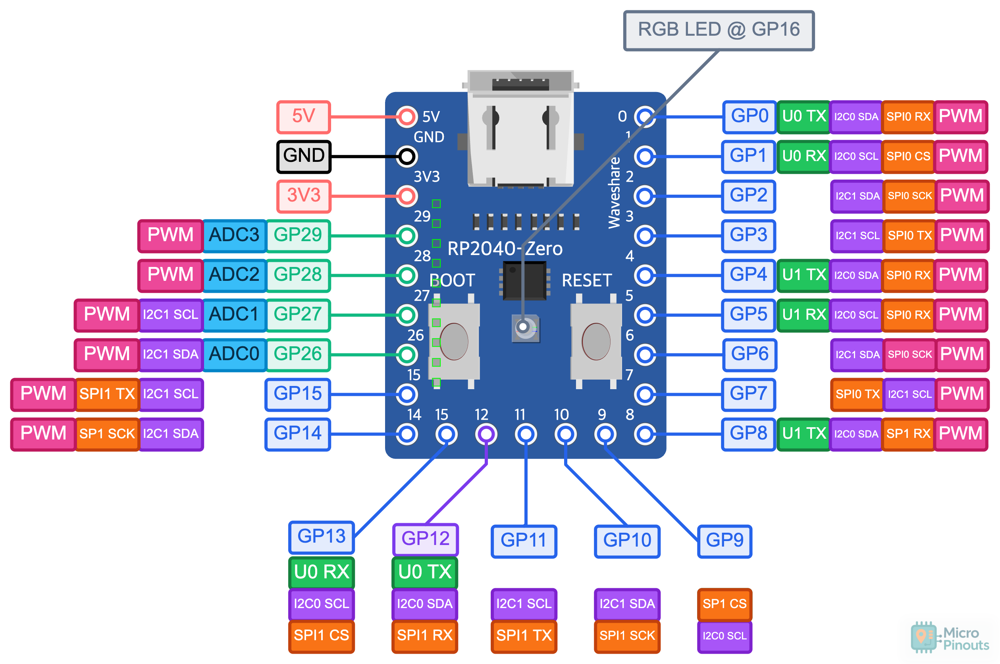

# 내가 원하는 키보드 만들기

## 원하는 기능

- 분할 키보드
- 가운데 추가 키 배치

### 주요 포인트

1. 한글 타이핑을 할 경우 'ㅠ' 키를 자주 사용하게 되는데, 기존의 분할 키보드들은 가운데에 키가 없어서 불편했습니다.
그래서, 양쪽 키보드 B키를 추가 배치 했습니다.
2. 그리고, '한/영'가 윈도우에서는 스페이스바 옆 ALT 키로 매핑이 되어 있는데, 개발하면서 한영키를 자주 전환을 하게 되는데, 이 때 주로 엄지 손가락으로 ALT키를 눌러서 손가락이 불편했습니다. 그렇다고 한영키를 누르기 위해서 손을 키보드 아래로 내려가 하는 것도 불편해서 한/영키를 오른쪽 키보드 B키 밑으로 배치를 했습니다.
3. 잘 사용하지 않는 Caps Lock 키를 펑션키로 매핑을 했습니다. 이렇게 하면, 펑션키를 누르기 위해서 손을 키보드 아래로 내릴 필요가 없어서 편리합니다.

# 키보드 전체 레이아웃


제작 : [http://www.keyboard-layout-editor.com/](http://www.keyboard-layout-editor.com/)

---

#### 제작 화면


# 데이터

키보드 [www.keyboard-layout-editor.com](http://www.keyboard-layout-editor.com) 에서 아래 데이터를 `</> Raw Data` 탭을 선택해서 넣어 주면 키보드의 구성을 편집 할 수 있습니다.

### 좌측

```json
[{c:"#ff0000",t:"#ffffff"},"ESC",{x:0.25,c:"#cccccc",t:"#000000",a:7},"F1","F2","F3","F4","F5","F6"],
[{y:0.25,a:4},"~\n\n\n\n\n\n\n\n\n`","!\n1\n\nF1","@\n2\n\nF2","#\n3\n\nF3","$\n4\n\nF4","%\n5\n\nF5","^\n6\n\nF6"],
[{c:"#c8c3b8",w:1.5},"Tab",{c:"#cccccc"},"Q\n\n\n\n\n\n\n\n\nㅂ","W\n\n\n\n\n\n\n\n\nㅈ","E\n\n\n\n\n\n\n\n\nㄷ","R\n\n\n\n\n\n\n\n\nㄱ","T\n\n\n\n\n\n\n\n\nㅅ"],
[{c:"#c8c3b8",w:1.75},"Function.1",{c:"#cccccc"},"A\n\n\n\n\n\n\n\n\nㅁ","S\n\n\n\n\n\n\n\n\nㄴ","D\n\n\n\n\n\n\n\n\nㅇ","F\n\n\n\n\n\n\n\n\nㄹ","G\n\n\n\n\n\n\n\n\nㅎ"],
[{c:"#c8c3b8",w:2.25},"Shift",{c:"#cccccc"},"Z\n\n\n\n\n\n\n\n\nㅋ","X\n\n\n\n\n\n\n\n\nㅌ","C\n\n\n\n\n\n\n\n\nㅊ","V\n\n\n\n\n\n\n\n\nㅍ","B\n\n\n\n\n\n\n\n\nㅠ"],
[{c:"#c8c3b8",w:1.25},"Ctrl",{w:1.25},"Win",{w:1.25},"Alt",{w:1.25},"Fn.2",{w:2.25},"Space"]

```

### 우측

```json
[{x:0.5,a:7},"F7","F8","F9","F10","F11","F12",{x:0.25},"SCR","Mute","Sleep"],
[{y:0.25,x:0.75,a:4},"&\n7\n\nF7","*\n8\n\nF8","(\n9\n\nF9",")\n0\n\nF10","_\n-\n\nF11","+\n=\n\nF12",{c:"#c8c3b8",w:2},"Backspace",{c:"#63696a"},"Home"],
[{x:0.25,c:"#cccccc"},"Y\n\n\n\n\n\n\n\n\nㅛ","U\n\n\n\n\n\n\n\n\nㅕ","I\n\n\n\n\n\n\n\n\nㅑ","O\n\n\n\n\n\n\n\n\nㅐ","P\n\n\n\n\n\n\n\n\nㅔ","{\n[","}\n]",{c:"#c8c3b8",w:1.5},"|\n\\",{c:"#63696a"},"End"],
[{x:0.5,c:"#cccccc"},"H\n\n\n\n\n\n\n\n\nㅗ","J\n\n\n\n\n\n\n\n\nㅓ","K\n\n\n\n\n\n\n\n\nㅏ","L\n\n\n\n\n\n\n\n\nㅣ",":\n;","\"\n'",{c:"#c8c3b8",w:2.25},"Enter",{c:"#63696a"},"PgUp"],
[{c:"#ffe08d"},"B\n\n\n\n\n\n\n\n\nㅠ",{c:"#cccccc"},"N\n\n\n\n\n\n\n\n\nㅜ","M\n\n\n\n\n\n\n\n\nㅡ","<\n,",">\n.","?\n/",{c:"#c8c3b8",w:1.75},"Shift",{c:"#ea4221",a:7},"↑",{c:"#63696a",a:4},"PgDn"],
[{c:"#ffe08d"},"한/영",{c:"#c8c3b8",w:2.75},"Space","Alt","Fn.1","Del",{c:"#ea4221",a:7},"←","↓","→"]
```

# 써머리


# 준비물


|                                                   | 부품명                       | 수량  | 설명                        | 링크                                                                   |
| :-------------------------------------------------: | ------------------------- | :---: | ------------------------- | -------------------------------------------------------------------- |
|   | RP2040-Zero RP2040        | 2   | 보드용                       | [연결](https://ko.aliexpress.com/item/1005003823256706.html)           |
|  | 스테레오 커넥터 / 3.5mm / FEMALE | 2   | 보드 연결 용                   | [연결](https://www.devicemart.co.kr/goods/view?no=1067728)             |
|                  | 3.5mm aux 케이블             | 1   | 보드 연결 용                   | [연결](https://ko.aliexpress.com/item/1005006150639643.html)           |
|                  | 코스타 스테빌 라이저               | 2   | 긴 키 안정 (5개가 필요 해서 2세트 구매) | [연결](https://ko.aliexpress.com/w/wholesale-costar-stabilizer.html)   |
|                      | 전선                        | 1   | 랩핑와이어 추천(인두기로 녹여서 사용가능)   | [연결](https://www.devicemart.co.kr/goods/view?no=1274107)             |
|              | 스위치                       | 77  | 개인 취향으로 게이트론 백축을 선택 했습니다. | [연결](https://smartstore.naver.com/happysaturday/products/5541876955) |
|                  | 키캡                        | -   | 되도록이면 XDA 또는 DSA를 선택 합니다. | [연결](https://ko.aliexpress.com/w/wholesale-xda-keycap.html)          |
|                      | 미끄럼 방지 패드 or 범퍼           | 1   | 바닥 미끄럼 방지                 | [연결](https://www.coupang.com/vp/products/6265639245)                 |
|              | 다이오드(1N4148/MMSD4148)     | 77  |                           | [연결](https://www.devicemart.co.kr/goods/view?no=6382)                |
|       | 인서트(spredsert)            | 8   | 케이스 조립용                   | [연결](https://www.devicemart.co.kr/goods/view?no=1067969)             |
|                        | 접시머리 십자볼트 M3*10           | 8   | 케이스 조립용                   | [연결](https://www.devicemart.co.kr/goods/view?no=34782)               |
|                                                   | 납땜 재료                     | -   | 인두기, 납, 인두기 스탠드 등등        |                                                                      |


### RP2040-Zero 핀 배치

행(ROW) 핀은 좌우 공통이고, 열(COL) 핀은 우측이 2열(GP13, GP14) 더 많습니다.
TRRS 케이블은 GP15(시리얼) · 5V · GND 3선을 사용합니다.





| RP2040-Zero 핀 | 좌측 보드    | 우측 보드    |
| :-------------: | :--------: | :--------: |
| GP0           | ROW 0    | ROW 0    |
| GP1           | ROW 1    | ROW 1    |
| GP2           | ROW 2    | ROW 2    |
| GP3           | ROW 3    | ROW 3    |
| GP4           | ROW 4    | ROW 4    |
| GP5           | ROW 5    | ROW 5    |
| GP6           | COL 0    | COL 0    |
| GP7           | COL 1    | COL 1    |
| GP8           | COL 2    | COL 2    |
| GP9           | COL 3    | COL 3    |
| GP10          | COL 4    | COL 4    |
| GP11          | COL 5    | COL 5    |
| GP12          | COL 6    | COL 6    |
| GP13          | —        | COL 7    |
| GP14          | —        | COL 8    |
| GP15          | TRRS 시리얼 | TRRS 시리얼 |
| 5V            | TRRS VCC | TRRS VCC |
| GND           | TRRS GND | TRRS GND |


- 다이오드 방향: `COL2ROW`
- USB는 우측 보드에 연결합니다(`MASTER_RIGHT`). 좌측은 TRRS로만 연결됩니다.
- 펌웨어 정의: `gkey/config.h`의 `MATRIX_ROW_PINS` / `MATRIX_COL_PINS` / `SERIAL_USART_TX_PIN`


&nbsp;

### 좌측


### 우측


핀 배선은 [kbfirmware.com](https://kbfirmware.com/) 에서 만들었습니다.

# 스트레오 컨넥트 연결 핀


# QMK

## QMK 설치

macOS 기준입니다. Homebrew로 QMK CLI를 설치하고 `qmk setup`으로 초기화합니다.

```bash
brew install qmk
qmk setup
```

`qmk setup`을 하면 홈 폴더에 `qmk_firmware` 폴더가 생깁니다.

### ARM 툴체인 (RP2040 필수)

RP2040은 ARM 툴체인으로 빌드합니다. 그런데 Homebrew의 `arm-none-eabi-gcc`(16.1.0 기준)는 newlib이 빠져 있어서 `fatal error: stdint.h: No such file or directory`로 컴파일이 실패합니다. ARM 공식 툴체인을 설치해야 합니다.

```bash
brew install --cask gcc-arm-embedded
```

설치 경로는 `/Applications/ArmGNUToolchain/<버전>/arm-none-eabi/bin` 입니다(예: `15.2.rel1`). 컴파일할 때 이 경로를 PATH 앞에 두면 됩니다(아래 참고). brew의 `arm-none-eabi-gcc`는 지우지 않아도 PATH 우선순위로 우회됩니다.

## 소스 연결 하기

qmk를 설치하고 나면 qmk_firmware라는 폴더가 생기고, 그 안에 있는 `keyboards` 폴더에 소스 파일을 넣어 주고 컴파일을 해야 합니다.
저 같은 경우에는 폴더를 symbolic link를 걸어서 넣어 줬습니다.

```bash
ln -snf $HOME/qmk_firmware/keyboards/gkey `pwd`/gkey
```

## 컴파일 하기

RP2040은 `.uf2` 파일로 빌드됩니다. ARM 공식 툴체인을 PATH 앞에 두고 컴파일합니다.

```bash
cd $HOME/qmk_firmware
PATH="/Applications/ArmGNUToolchain/15.2.rel1/arm-none-eabi/bin:$PATH" qmk compile -kb gkey -km default
```

컴파일 결과 `gkey_default.uf2`가 `$HOME/qmk_firmware/.build` 폴더에 생성됩니다.

## 플래시 (RP2040-Zero)

1. RP2040-Zero의 `BOOTSEL` 버튼을 누른 채 USB를 연결하면 `RPI-RP2` 이름의 저장장치로 마운트됩니다.
2. `gkey_default.uf2` 파일을 `RPI-RP2`에 드래그하면 자동으로 재부팅되며 펌웨어가 적용됩니다.
3. 좌·우 두 보드를 각각 BOOTSEL로 연결해 같은 `.uf2`를 플래시합니다. (사용 시 USB는 우측 보드에 연결 — `MASTER_RIGHT`)

여기까지 했으면 조립해서 사용하시면 됩니다.