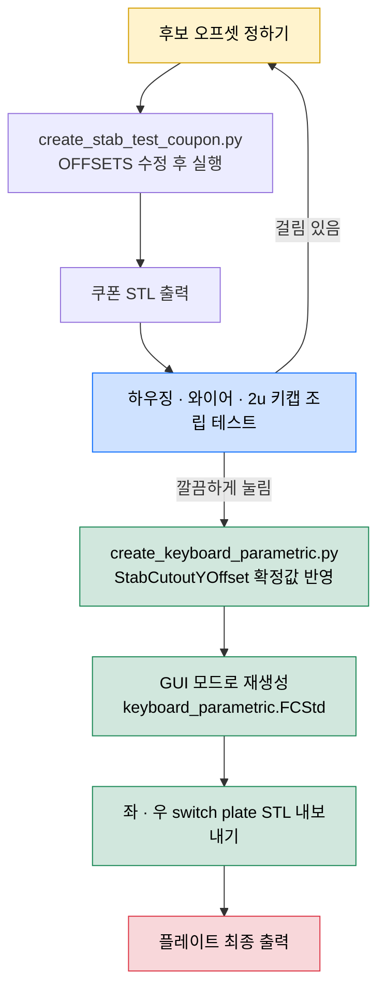

# 내가 원하는 키보드 만들기

## 원하는 기능

- 분할 키보드
- 가운데 추가 키 배치

### 주요 포인트

1. 한글 타이핑을 할 경우 'ㅠ' 키를 자주 사용하게 되는데, 기존의 분할 키보드들은 가운데에 키가 없어서 불편했습니다.
그래서, 양쪽 키보드 B키를 추가 배치 했습니다.
2. 그리고, '한/영'가 윈도우에서는 스페이스바 옆 ALT 키로 매핑이 되어 있는데, 개발하면서 한영키를 자주 전환을 하게 되는데, 이 때 주로 엄지 손가락으로 ALT키를 눌러서 손가락이 불편했습니다. 그렇다고 한영키를 누르기 위해서 손을 키보드 아래로 내려가 하는 것도 불편해서 한/영키를 오른쪽 키보드 B키 밑으로 배치를 했습니다.
3. 잘 사용하지 않는 Caps Lock 자리를 **Fn 키**로 매핑을 했습니다. 이렇게 하면, **F1~F12**를 누르기 위해서 손을 키보드 아래로 내릴 필요가 없어서 편리합니다.
4. 그래서 펑션 행(F1~F12 전용 최상단 줄)을 아예 없앴습니다. `Fn`+숫자로 F1~F12가 나오므로 잃는 기능이 없고, 반쪽당 한 행씩 줄어 키보드가 작아집니다. 비워진 좌상단 자리는 Esc가 차지합니다 — 그냥 누르면 `Esc`, `Shift`와 함께 누르면 `~`, `Fn`과 함께 누르면 `` ` `` 입니다.

# 키보드 전체 레이아웃


> ⚠ 이 그림은 펑션 행이 있던 6행 88키 구배열 기준이다. 현재 배열은 아래 `# 데이터`의 KLE 원본(5행 72키)이 원천이며, 그림은 5행 실물이 확정된 뒤 갱신한다.

제작 : [http://www.keyboard-layout-editor.com/](http://www.keyboard-layout-editor.com/)

---

#### 제작 화면


# 데이터

키보드 [www.keyboard-layout-editor.com](http://www.keyboard-layout-editor.com) 에서 아래 데이터를 `</> Raw Data` 탭을 선택해서 넣어 주면 키보드의 구성을 편집 할 수 있습니다.

## 배열을 바꿀 때

배열의 원천은 **`keylayout-left.json` · `keylayout-right.json` 두 파일뿐**입니다. 아래는 모두 생성물이므로 손으로 고치지 마세요.

| 생성물 | 생성기 |
| --- | --- |
| `keylayout.json` (통합본), README 의 아래 인라인 블록 | `python3 tools/gen_keylayout.py` |
| `freecad/left-switch.dxf` · `right-switch.dxf` | `python3 tools/gen_dxf.py` |

절차는 이렇습니다.

```
keylayout-left/right.json 수정
  → python3 tools/gen_keylayout.py     (통합본 + README 인라인)
  → python3 tools/gen_dxf.py           (스위치 플레이트 DXF)
  → python3 tools/test_gen_dxf.py      (생성기가 원본을 재현하는지 회귀 검사)
  → python3 tools/verify_keylayout.py  (배열·펌웨어 7곳 일치 검사)
  → gkey/ 펌웨어 수정 (행·열이 바뀐 경우)
  → FreeCAD 모델 재생성 (아래 "케이스 3D 출력" 참고)
```

`tools/test_gen_dxf.py` 는 `freecad/reference/` 의 6행 기준 픽스처로 "구 KLE → 생성 → 원본 DXF 대조"를 수행합니다. 생성기를 고쳤을 때 회귀를 잡는 유일한 검사이므로 지우지 마세요.

### 좌측

```json
[{a:4},"~\nESC\n\n`","!\n1\n\nF1","@\n2\n\nF2","#\n3\n\nF3","$\n4\n\nF4","%\n5\n\nF5","^\n6\n\nF6"],
[{c:"#c8c3b8",w:1.5},"Tab",{c:"#cccccc"},"Q\n\n\n\n\n\n\n\n\nㅂ","W\n\n\n\n\n\n\n\n\nㅈ","E\n\n\n\n\n\n\n\n\nㄷ","R\n\n\n\n\n\n\n\n\nㄱ","T\n\n\n\n\n\n\n\n\nㅅ"],
[{c:"#c8c3b8",w:1.75},"Function.1",{c:"#cccccc"},"A\n\n\n\n\n\n\n\n\nㅁ","S\n\n\n\n\n\n\n\n\nㄴ","D\n\n\n\n\n\n\n\n\nㅇ","F\n\n\n\n\n\n\n\n\nㄹ","G\n\n\n\n\n\n\n\n\nㅎ"],
[{c:"#c8c3b8",w:2.25},"Shift",{c:"#cccccc"},"Z\n\n\n\n\n\n\n\n\nㅋ","X\n\n\n\n\n\n\n\n\nㅌ","C\n\n\n\n\n\n\n\n\nㅊ","V\n\n\n\n\n\n\n\n\nㅍ","B\n\n\n\n\n\n\n\n\nㅠ"],
[{c:"#c8c3b8",w:1.25},"Ctrl",{w:1.25},"Win",{w:1.25},"Alt",{w:1.25},"Fn.2",{w:2.25},"Space"]
```

### 우측

```json
[{x:0.75,a:4},"&\n7\n\nF7","*\n8\n\nF8","(\n9\n\nF9",")\n0\n\nF10","_\n-\n\nF11","+\n=\n\nF12",{c:"#c8c3b8",w:2},"Backspace",{c:"#63696a"},"Home"],
[{x:0.25,c:"#cccccc"},"Y\n\n\n\n\n\n\n\n\nㅛ","U\n\n\n\n\n\n\n\n\nㅕ","I\n\n\n\n\n\n\n\n\nㅑ","O\n\n\n\n\n\n\n\n\nㅐ","P\n\n\n\n\n\n\n\n\nㅔ","{\n[","}\n]",{c:"#c8c3b8",w:1.5},"|\n\\",{c:"#63696a"},"End"],
[{x:0.5,c:"#cccccc"},"H\n\n\n\n\n\n\n\n\nㅗ","J\n\n\n\n\n\n\n\n\nㅓ","K\n\n\n\n\n\n\n\n\nㅏ","L\n\n\n\n\n\n\n\n\nㅣ",":\n;","\"\n'",{c:"#c8c3b8",w:2.25},"Enter",{c:"#63696a"},"PgUp"],
[{c:"#ffe08d"},"B\n\n\n\n\n\n\n\n\nㅠ",{c:"#cccccc"},"N\n\n\n\n\n\n\n\n\nㅜ","M\n\n\n\n\n\n\n\n\nㅡ","<\n,",">\n.","?\n/",{c:"#c8c3b8",w:1.75},"Shift",{c:"#ea4221",a:7},"↑",{c:"#63696a",a:4},"PgDn"],
[{c:"#ffe08d"},"한/영",{c:"#c8c3b8",w:2.75},"Space","Fn.1","Ins","Del",{c:"#ea4221",a:7},"←","↓","→"]
```

# 써머리


# 준비물


|                                                   | 부품명                       | 수량  | 설명                        | 링크                                                                   |
| :-------------------------------------------------: | ------------------------- | :---: | ------------------------- | -------------------------------------------------------------------- |
|   | RP2040-Zero RP2040        | 2   | 보드용                       | [연결](https://ko.aliexpress.com/item/1005003823256706.html)           |
|  | 스테레오 커넥터 / 3.5mm / FEMALE | 2   | 보드 연결 용                   | [연결](https://www.devicemart.co.kr/goods/view?no=1067728)             |
|                  | 3.5mm aux 케이블             | 1   | 보드 연결 용                   | [연결](https://ko.aliexpress.com/item/1005006150639643.html)           |
|                  | 코스타 스테빌 라이저               | 2   | 긴 키 안정 (5개가 필요 해서 2세트 구매) | [연결](https://ko.aliexpress.com/w/wholesale-costar-stabilizer.html)   |
|                      | 전선                        | 1   | 랩핑와이어 추천(인두기로 녹여서 사용가능)   | [연결](https://www.devicemart.co.kr/goods/view?no=1274107)             |
|              | 스위치                       | 72  | 개인 취향으로 게이트론 백축을 선택 했습니다. | [연결](https://smartstore.naver.com/happysaturday/products/5541876955) |
|                  | 키캡                        | -   | 되도록이면 XDA 또는 DSA를 선택 합니다. | [연결](https://ko.aliexpress.com/w/wholesale-xda-keycap.html)          |
|                      | 미끄럼 방지 패드 or 범퍼           | 1   | 바닥 미끄럼 방지                 | [연결](https://www.coupang.com/vp/products/6265639245)                 |
|              | 다이오드(1N4148/MMSD4148)     | 72  |                           | [연결](https://www.devicemart.co.kr/goods/view?no=6382)                |
|       | 인서트(spredsert)            | 8   | 케이스 조립용                   | [연결](https://www.devicemart.co.kr/goods/view?no=1067969)             |
|                        | 접시머리 십자볼트 M3*10           | 8   | 케이스 조립용                   | [연결](https://www.devicemart.co.kr/goods/view?no=34782)               |
|                                                   | 납땜 재료                     | -   | 인두기, 납, 인두기 스탠드 등등        |                                                                      |


### RP2040-Zero 핀 배치

행(ROW) 핀은 좌우 공통이고, 열(COL) 핀은 우측이 2열(GP13, GP14) 더 많습니다.
TRRS 케이블은 GP15(시리얼) · 5V · GND 3선을 사용합니다.


| RP2040-Zero 핀   | 좌측 보드    | 우측 보드    |
| :---------------: | :--------: | :--------: |
| GP0             | ROW 0    | ROW 0    |
| GP1             | ROW 1    | ROW 1    |
| GP2             | ROW 2    | ROW 2    |
| GP3             | ROW 3    | ROW 3    |
| GP4             | ROW 4    | ROW 4    |
| GP5             | ROW 5    | ROW 5    |
| GP6             | COL 0    | COL 0    |
| GP7             | COL 1    | COL 1    |
| GP8             | COL 2    | COL 2    |
| GP9             | COL 3    | COL 3    |
| GP10            | COL 4    | COL 4    |
| GP11            | COL 5    | COL 5    |
| GP12            | COL 6    | COL 6    |
| GP13            | —        | COL 7    |
| GP14            | —        | COL 8    |
| GP15            | TRRS 시리얼 | TRRS 시리얼 |
| uuuuuuuuuuuuu5V | TRRS VCC | TRRS VCC |
| GND             | TRRS GND | TRRS GND |


- 다이오드 방향: `COL2ROW`
- USB는 우측 보드에 연결합니다(`MASTER_RIGHT`). 좌측은 TRRS로만 연결됩니다.
- 펌웨어 정의: `gkey/config.h`의 `MATRIX_ROW_PINS` / `MATRIX_COL_PINS` / `SERIAL_USART_TX_PIN`


&nbsp;

### 좌측

> ⚠ 6행 배선 기준 — 현재 배열은 5행(`MATRIX_ROW_PINS { GP0..GP4 }`)이므로 이 그림은 낡았다. 5행 실물이 확정된 뒤 다시 그린다.


### 우측

> ⚠ 6행 배선 기준 — 위와 같이 낡았다.


핀 배선은 [kbfirmware.com](https://kbfirmware.com/) 에서 만들었습니다.

# 스트레오 컨넥트 연결 핀


# 케이스 3D 출력

## FreeCAD 모델


파라메트릭 모델(`freecad/keyboard_parametric.FCStd`) 전체입니다. 노란색이 좌측, 파란색이 우측 스위치 플레이트이고 앞쪽 검은색이 팜레스트입니다. 우측 플레이트 구멍으로 RP2040-Zero(노랑)와 3.5mm 잭(초록) 참조 부품이 비칩니다. 좌우 반쪽은 화면에서 보기 좋게 벌려 놓은 것이라 실제 배치 간격과는 다릅니다.


위에서 본 모습입니다. 정사각형 구멍이 스위치 컷아웃, 가늘고 긴 구멍이 스테빌라이저 슬롯입니다.


출력물은 좌·우 4종씩 **8개**입니다. 모두 서포트 없이 출력됩니다.

| 부품 | 파일 | 자세 |
| --- | --- | --- |
| 스위치 플레이트 | `left_switch_plate.stl` · `right_switch_plate.stl` | 평평하게 |
| 케이스 바디 | `left_keyboard_body.stl` · `right_keyboard_body.stl` | 바닥면을 베드에, **눕혀서** |
| 틸트 웨지 | `left_tilt_wedge.stl` · `right_tilt_wedge.stl` | 경사면을 베드에 |
| 팜레스트 | `left_palm_rest.stl` · `right_palm_rest.stl` | 평평하게 |

전부 `freecad/parametric_stl/` 에 있습니다.

## 틸트 웨지는 따로 뽑아 붙입니다

케이스를 앞으로 기울여 세우는 쐐기(**틸트 웨지**)는 바디와 한 몸이 아니라 **별도 부품**입니다. 바디 바깥선보다 6mm 안쪽으로 들어가 앉는 형상이라 한 몸으로 뽑으면 바닥면 테두리가 공중에 뜨고, 그 언더컷은 어떤 출력 자세로도 서포트 없이 나오지 않기 때문입니다. 자세한 경위는 `.forge/adr/260819-204944-tilt-wedge-as-separate-glued-part.md` 에 있습니다.

조립 순서:

1. 웨지 상단면의 **핀 2개**(지름 4mm)를 바디 바닥의 홀 2개에 맞춥니다. 위치는 이 핀이 잡아 주므로 눈대중으로 맞출 필요가 없습니다.
2. 웨지 상단면에 접착제를 바르고 눌러 붙입니다. 핀은 정렬용이라 고정력은 접착제가 냅니다.
3. 접착이 마른 뒤 케이스를 책상에 놓아 앞으로 기울어지는지 확인합니다.

웨지를 빠뜨리면 케이스는 멀쩡해 보이지만 기울지 않습니다. 조립을 다 하고 나서야 알게 되므로 출력 단계에서 챙기세요.

## 서포트 검사

형상을 고친 뒤에는 서포트가 다시 생겼는지 스크립트로 확인할 수 있습니다. FreeCAD 없이 STL만 읽습니다.

```bash
python3 freecad/verify_no_support.py
```

각 부품을 "가장 넓은 아래쪽 평면으로 눕힌다"는 슬라이서와 같은 규칙으로 세운 뒤, 베드에 닿는 면을 빼고 45°를 넘는 하향면 면적을 합산합니다. 통과 기준은 60mm² 이하이고, 이 여유는 자석 포켓·잭 구멍처럼 브리징으로 넘어가는 원형 구멍 천장 몫입니다.

## 슬라이서 프로젝트

`freecad/parametric_stl/split keyboard.3mf` 는 Bambu Studio 프로젝트입니다. **STL을 다시 내보내도 이 파일은 따라서 갱신되지 않습니다** — 슬라이서가 STL을 프로젝트 안으로 복사해 두기 때문입니다. 형상을 바꿨다면 프로젝트를 열어 부품을 다시 불러오세요.

> ⚠ 배열이 5행 72키로 바뀌었으므로 이 프로젝트는 6행 형상을 담고 있습니다. 출력 전에 열어서 부품 8개를 모두 다시 불러오세요.

# 스테빌라이저 슬롯 오프셋 조정

코스타 스테빌라이저는 와이어가 스위치 플레이트 **아래쪽**을 지나갑니다. 이 플레이트에는 두 슬롯 사이를 잇는 와이어 통로가 없어서, 하우징을 먼저 끼운 뒤 아래에서 와이어를 걸어 조립합니다. (2u 키의 스위치는 180도 돌려 끼워야 와이어와 간섭하지 않습니다.)

DXF 원본의 스테빌 슬롯은 스위치 중심보다 0.65mm 아래에 있습니다. 이 위치 그대로 출력하면 스위치·키캡 조합에 따라 와이어가 키캡 스커트나 스위치 하우징에 닿아서 눌림이 뻑뻑해집니다. 그래서 슬롯을 Y 방향으로 미세하게 밀어 주는 보정값 `StabCutoutYOffset`을 두었습니다.

**적정값은 쓰는 스위치와 키캡에 따라 달라집니다.** 스위치를 바꾸면 그 값도 다시 잡아야 하므로, 아래 순서로 테스트 쿠폰을 뽑아 확인한 뒤 플레이트에 반영합니다.

| 항목 | 값 |
| --- | --- |
| 파라미터 | `freecad/create_keyboard_parametric.py`의 `PARAMS["StabCutoutYOffset"]` |
| 현재 값 | **+0.2 mm** (슬롯 중심이 스위치 중심 대비 -0.45mm) |
| 이전 값 | +0.5 mm — 다른 스위치를 기준으로 잡았던 값 |
| 오프셋 0 | DXF 원본 위치 (스위치 중심 대비 -0.65mm) |

## 1. 테스트 쿠폰 출력

플레이트 전체를 몇 시간씩 출력하면서 값을 찾는 대신, 스위치홀 1개 + 스테빌 슬롯 2개만 남긴 2mm 두께 쿠폰을 후보값마다 한 판에 뽑습니다.

저장소에 **기본 쿠폰 STL**이 들어 있습니다. +0.0 ~ +0.5를 0.1 간격으로 담은 6칸짜리(192 × 22 × 2mm) 입니다.

```
freecad/parametric_stl/stab_test_coupon_0.00_0.10_0.20_0.30_0.40_0.50.stl
```

스위치를 바꿔서 값을 다시 잡아야 할 때는 보통 이 파일을 그대로 출력하면 됩니다. 다른 범위가 필요하면 `freecad/create_stab_test_coupon.py`의 `OFFSETS` 리스트에 시험할 값을 넣고 실행합니다.

```python
OFFSETS = [0.6, 0.7, 0.8]   # 기본 쿠폰 범위 밖을 볼 때
```

```bash
/Applications/FreeCAD.app/Contents/MacOS/FreeCAD --console freecad/create_stab_test_coupon.py < /dev/null
```

- 결과물은 `freecad/parametric_stl/stab_test_coupon_<값들>.stl` 입니다. 파일명에 값이 들어가므로 이전 쿠폰을 덮어쓰지 않습니다.
- 스테이션은 왼쪽부터 값 오름차순이고, 앞쪽 모서리의 **노치 개수 = 스테이션 번호**입니다. 잘라 쓰거나 뒤집어도 어느 값인지 알 수 있습니다.
- 스테이션 간격은 32mm로 2u 키캡 전폭보다 좁습니다. 한 번에 한 자리씩 조립해서 확인합니다.
- 클립 렛지(1.4mm)는 실제 플레이트와 같지만 바 두께가 2mm라 슬롯 벽이 얕습니다. 하우징이 실제 플레이트보다 헐겁게 느껴질 수 있습니다.

## 2. 값 판정

각 스테이션에 스테빌 하우징을 끼우고, 아래에서 와이어를 건 뒤, 2u 키캡을 씌워 눌러 봅니다. 걸림이나 뻑뻑함 없이 끝까지 눌리는 값을 고릅니다. 통과하는 값이 없으면 범위를 옮겨 쿠폰을 다시 뽑습니다.

## 3. 플레이트에 반영

`freecad/create_keyboard_parametric.py`의 `PARAMS["StabCutoutYOffset"]`를 확정값으로 고친 뒤, **GUI 모드**로 스크립트를 재실행합니다.

> ⚠️ `keyboard_parametric.FCStd`를 FreeCAD에서 열어 `Parameters` 스프레드시트의 값만 바꾸면 슬롯은 움직이지 않습니다. 스케치 지오메트리는 생성 시점의 값으로 구워지기 때문에, 반드시 스크립트를 재실행해야 합니다.
>
> ⚠️ 헤드리스(`--console`)로 재생성하면 파트 색상이 빠진 채 저장됩니다. GUI 모드로 실행하세요.

스크립트 자체는 `.FCStd`만 저장하므로, 스위치 플레이트 STL은 이어서 직접 내보냅니다. 아래 내용을 파일로 저장해 GUI 모드로 실행하거나, FreeCAD의 파이썬 콘솔에 붙여 넣습니다.

```python
import os
import FreeCAD as App
import Mesh

BASE = os.path.expanduser("~/workspace/my-keyboard/freecad")   # 저장소 경로에 맞게 수정
script = os.path.join(BASE, "create_keyboard_parametric.py")

for name in list(App.listDocuments().keys()):
    App.closeDocument(name)
exec(compile(open(script).read(), script, "exec"),
     {"__file__": script, "__name__": "__main__"})

doc = App.getDocument("Keyboard_Parametric")
for side in ("Left", "Right"):
    obj = doc.getObject(side + "_Switch_Plate")
    Mesh.export([obj], os.path.join(BASE, "parametric_stl",
                                   "%s_switch_plate.stl" % side.lower()))
```

```bash
/Applications/FreeCAD.app/Contents/MacOS/FreeCAD 위에서_저장한_스크립트.py
```

오프셋은 슬롯 위치만 바꾸므로 바디·팜레스트 STL은 다시 내보낼 필요가 없습니다. 재생성 뒤에는 STL의 스테빌 슬롯 Y좌표가 값 차이만큼(예: +0.5 → +0.2 이면 -0.3mm) 이동했는지 확인하면 됩니다. 슬롯은 좌측 4개, 우측 6개입니다.

## 전체 흐름



# QMK

## QMK 설치

macOS 기준입니다. Homebrew로 QMK CLI를 설치하고 `qmk setup`으로 초기화합니다.

```bash
brew install qmk
qmk setup
```

`qmk setup`을 하면 홈 폴더에 `qmk_firmware` 폴더가 생깁니다.

### ARM 툴체인 (RP2040 필수)

RP2040은 ARM 툴체인으로 빌드합니다. 그런데 Homebrew의 `arm-none-eabi-gcc`(16.1.0 기준)는 newlib이 빠져 있어서 `fatal error: stdint.h: No such file or directory`로 컴파일이 실패합니다. ARM 공식 툴체인을 설치해야 합니다.

```bash
brew install --cask gcc-arm-embedded
```

설치 경로는 `/Applications/ArmGNUToolchain/<버전>/arm-none-eabi/bin` 입니다(예: `15.2.rel1`). 컴파일할 때 이 경로를 PATH 앞에 두면 됩니다(아래 참고). brew의 `arm-none-eabi-gcc`는 지우지 않아도 PATH 우선순위로 우회됩니다.

## 소스 연결 하기

qmk를 설치하고 나면 qmk_firmware라는 폴더가 생기고, 그 안에 있는 `keyboards` 폴더에 소스 파일을 넣어 주고 컴파일을 해야 합니다.
저 같은 경우에는 폴더를 symbolic link를 걸어서 넣어 줬습니다.

```bash
ln -snf $HOME/qmk_firmware/keyboards/gkey `pwd`/gkey
```

## 컴파일 하기

RP2040은 `.uf2` 파일로 빌드됩니다. ARM 공식 툴체인을 PATH 앞에 두고 컴파일합니다.

```bash
cd $HOME/qmk_firmware
PATH="/Applications/ArmGNUToolchain/15.2.rel1/arm-none-eabi/bin:$PATH" qmk compile -kb gkey -km default
```

컴파일 결과 `gkey_default.uf2`가 `$HOME/qmk_firmware/.build` 폴더에 생성됩니다.

## 플래시 (RP2040-Zero)

1. RP2040-Zero의 `BOOTSEL` 버튼을 누른 채 USB를 연결하면 `RPI-RP2` 이름의 저장장치로 마운트됩니다.
2. `gkey_default.uf2` 파일을 `RPI-RP2`에 드래그하면 자동으로 재부팅되며 펌웨어가 적용됩니다.
3. 좌·우 두 보드를 각각 BOOTSEL로 연결해 같은 `.uf2`를 플래시합니다. (사용 시 USB는 우측 보드에 연결 — `MASTER_RIGHT`)

여기까지 했으면 조립해서 사용하시면 됩니다.