# 내가 원하는 키보드 만들기

> 새로운 버전 제작 중. 내용이 업데이트 중입니다.

## 원하는 기능

- 분할 키보드
- 가운데 추가 키 배치

### 주요 포인트
1. 한글 타이핑을 할 경우 'ㅠ' 키를 자주 사용하게 되는데, 기존의 분할 키보드들은 가운데에 키가 없어서 불편했습니다.
그래서, 양쪽 키보드 B키를 추가 배치 했습니다.
2. 그리고, '한/영'가 윈도우에서는 스페이스바 옆 ALT 키로 매핑이 되어 있는데, 개발하면서 한영키를 자주 전환을 하게 되는데, 이 때 주로 엄지 손가락으로 ALT키를 눌러서 손가락이 불편했습니다. 그렇다고 한영키를 누르기 위해서 손을 키보드 아래로 내려가 하는 것도 불편해서 한/영키를 오른쪽 키보드 B키 밑으로 배치를 했습니다.
3. 잘 사용하지 않는 Caps Lock 키를 펑션키로 매핑을 했습니다. 이렇게 하면, 펑션키를 누르기 위해서 손을 키보드 아래로 내릴 필요가 없어서 편리합니다.


# 키보드 전체 레이아웃


제작 : http://www.keyboard-layout-editor.com/


---
#### 제작 화면


# 데이터

키보드 [www.keyboard-layout-editor.com](http://www.keyboard-layout-editor.com) 에서 아래 데이터를 `</> Raw Data` 탭을 선택해서 넣어 주면 키보드의 구성을 편집 할 수 있습니다.

### 좌측

```json
[{c:"#ff0000",t:"#ffffff"},"ESC",{x:0.25,c:"#cccccc",t:"#000000",a:7},"F1","F2","F3","F4","F5","F6"],
[{y:0.25,a:4},"~\n\n\n\n\n\n\n\n\n`","!\n1\n\nF1","@\n2\n\nF2","#\n3\n\nF3","$\n4\n\nF4","%\n5\n\nF5","^\n6\n\nF6"],
[{c:"#c8c3b8",w:1.5},"Tab",{c:"#cccccc"},"Q\n\n\n\n\n\n\n\n\nㅂ","W\n\n\n\n\n\n\n\n\nㅈ","E\n\n\n\n\n\n\n\n\nㄷ","R\n\n\n\n\n\n\n\n\nㄱ","T\n\n\n\n\n\n\n\n\nㅅ"],
[{c:"#c8c3b8",w:1.75},"Function.1",{c:"#cccccc"},"A\n\n\n\n\n\n\n\n\nㅁ","S\n\n\n\n\n\n\n\n\nㄴ","D\n\n\n\n\n\n\n\n\nㅇ","F\n\n\n\n\n\n\n\n\nㄹ","G\n\n\n\n\n\n\n\n\nㅎ"],
[{c:"#c8c3b8",w:2.25},"Shift",{c:"#cccccc"},"Z\n\n\n\n\n\n\n\n\nㅋ","X\n\n\n\n\n\n\n\n\nㅌ","C\n\n\n\n\n\n\n\n\nㅊ","V\n\n\n\n\n\n\n\n\nㅍ","B\n\n\n\n\n\n\n\n\nㅠ"],
[{c:"#c8c3b8",w:1.25},"Ctrl",{w:1.25},"Win",{w:1.25},"Alt",{w:1.25},"Fn.2",{w:2.25},"Space"]

```

### 우측

```json
[{x:0.5,a:7},"F7","F8","F9","F10","F11","F12",{x:0.25},"SCR","Mute","Sleep"],
[{y:0.25,x:0.75,a:4},"&\n7\n\nF7","*\n8\n\nF8","(\n9\n\nF9",")\n0\n\nF10","_\n-\n\nF11","+\n=\n\nF12",{c:"#c8c3b8",w:2},"Backspace",{c:"#63696a"},"Home"],
[{x:0.25,c:"#cccccc"},"Y\n\n\n\n\n\n\n\n\nㅛ","U\n\n\n\n\n\n\n\n\nㅕ","I\n\n\n\n\n\n\n\n\nㅑ","O\n\n\n\n\n\n\n\n\nㅐ","P\n\n\n\n\n\n\n\n\nㅔ","{\n[","}\n]",{c:"#c8c3b8",w:1.5},"|\n\\",{c:"#63696a"},"End"],
[{x:0.5,c:"#cccccc"},"H\n\n\n\n\n\n\n\n\nㅗ","J\n\n\n\n\n\n\n\n\nㅓ","K\n\n\n\n\n\n\n\n\nㅏ","L\n\n\n\n\n\n\n\n\nㅣ",":\n;","\"\n'",{c:"#c8c3b8",w:2.25},"Enter",{c:"#63696a"},"PgUp"],
[{c:"#ffe08d"},"B\n\n\n\n\n\n\n\n\nㅠ",{c:"#cccccc"},"N\n\n\n\n\n\n\n\n\nㅜ","M\n\n\n\n\n\n\n\n\nㅡ","<\n,",">\n.","?\n/",{c:"#c8c3b8",w:1.75},"Shift",{c:"#ea4221",a:7},"↑",{c:"#63696a",a:4},"PgDn"],
[{c:"#ffe08d"},"한/영",{c:"#c8c3b8",w:2.75},"Space","Alt","Fn.1","Del",{c:"#ea4221",a:7},"←","↓","→"]
```

# 써머리

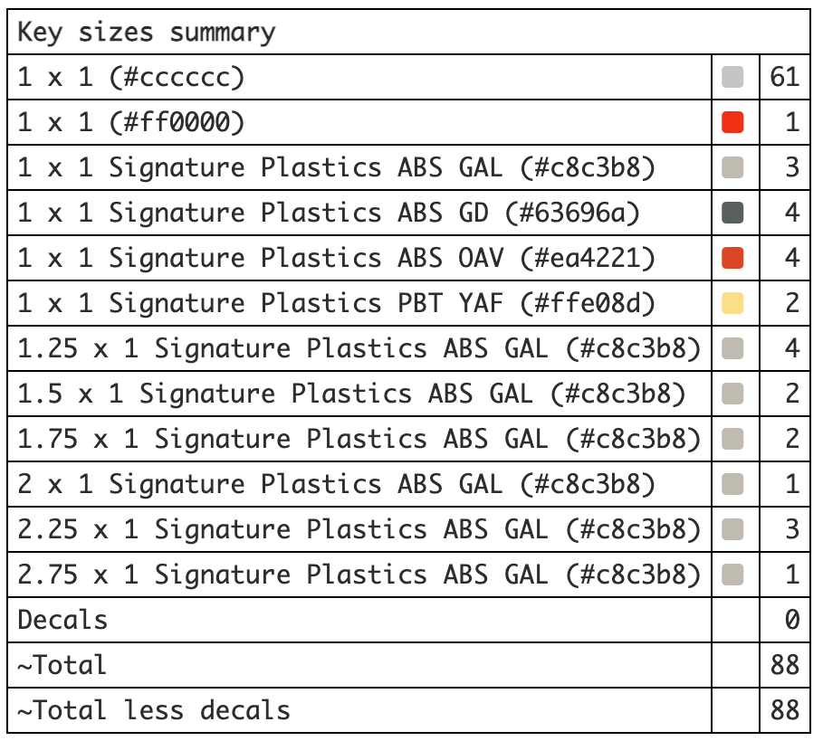

# 준비물


|                                                   | 부품명                           | 수량 | 설명                                         | 링크                                                                   |
| :-----------------------------------------------: | -------------------------------- | :--: | -------------------------------------------- | ---------------------------------------------------------------------- |
| 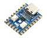  | RP2040-Zero RP2040               |  2   | 보드용                                       | [연결](https://ko.aliexpress.com/item/1005003823256706.html)           |
|  | 스테레오 커넥터 / 3.5mm / FEMALE |  2   | 보드 연결 용                                 | [연결](https://www.devicemart.co.kr/goods/view?no=1067728)             |
|         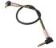         | 3.5mm aux 케이블                 |  1   | 보드 연결 용                                 | [연결](https://ko.aliexpress.com/item/1005006150639643.html)           |
|      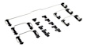      | 코스타 스테빌 라이저             |  2   | 긴 키 안정 (5개가 필요 해서 2세트 구매)  | [연결](https://ko.aliexpress.com/w/wholesale-costar-stabilizer.html)   |
|           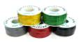           | 전선                             |  1   | 랩핑와이어 추천(인두기로 녹여서 사용가능)    | [연결](https://www.devicemart.co.kr/goods/view?no=1274107)             |
|       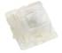       | 스위치                           |  77  | 개인 취향으로 게이트론 백축을 선택 했습니다. | [연결](https://smartstore.naver.com/happysaturday/products/5541876955) |
|         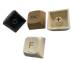         | 키캡                             |  -   | 되도록이면 XDA 또는 DSA를 선택 합니다.       | [연결](https://ko.aliexpress.com/w/wholesale-xda-keycap.html)             |
|           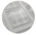           | 미끄럼 방지 패드 or 범퍼         |  1   | 바닥 미끄럼 방지                             | [연결](https://www.coupang.com/vp/products/6265639245)                 |
|          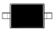          | 다이오드(1N4148/MMSD4148)                 |  77  |                                              | [연결](https://www.devicemart.co.kr/goods/view?no=6382)  |
|  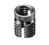  | 인서트(spredsert) | 8 | 케이스 조립용 | [연결](https://www.devicemart.co.kr/goods/view?no=1067969) |
| 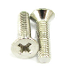 | 접시머리 십자볼트 M3*10 | 8 | 케이스 조립용 | [연결](https://www.devicemart.co.kr/goods/view?no=34782) |
|         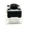         | 스위치                           |  2   | 펌웨어 업데이트용 리셋 스위치                | [연결](https://www.devicemart.co.kr/goods/view?no=34555)               |
|                                                   | 납땜 재료                        |  -   | 인두기, 납, 인두기 스탠드 등등               |                                                                        |

### RP2040-Zero 핀 배치

행(ROW) 핀은 좌우 공통이고, 열(COL) 핀은 우측이 2열(GP13, GP14) 더 많습니다.
TRRS 케이블은 GP15(시리얼) · 5V · GND 3선을 사용합니다.

| RP2040-Zero 핀 | 좌측 보드 | 우측 보드 |
| :------------: | :-------: | :-------: |
|      GP0       |   ROW 0   |   ROW 0   |
|      GP1       |   ROW 1   |   ROW 1   |
|      GP2       |   ROW 2   |   ROW 2   |
|      GP3       |   ROW 3   |   ROW 3   |
|      GP4       |   ROW 4   |   ROW 4   |
|      GP5       |   ROW 5   |   ROW 5   |
|      GP6       |   COL 0   |   COL 0   |
|      GP7       |   COL 1   |   COL 1   |
|      GP8       |   COL 2   |   COL 2   |
|      GP9       |   COL 3   |   COL 3   |
|      GP10      |   COL 4   |   COL 4   |
|      GP11      |   COL 5   |   COL 5   |
|      GP12      |   COL 6   |   COL 6   |
|      GP13      |     —     |   COL 7   |
|      GP14      |     —     |   COL 8   |
|      GP15      | TRRS 시리얼 | TRRS 시리얼 |
|       5V       | TRRS VCC  | TRRS VCC  |
|      GND       | TRRS GND  | TRRS GND  |

- 다이오드 방향: `COL2ROW`
- USB는 우측 보드에 연결합니다(`MASTER_RIGHT`). 좌측은 TRRS로만 연결됩니다.
- 펌웨어 정의: `gkey/config.h`의 `MATRIX_ROW_PINS` / `MATRIX_COL_PINS` / `SERIAL_USART_TX_PIN`

### 프로마이크로 핀 (구버전)


### 좌측


### 우측


핀 배선은 [kbfirmware.com](https://kbfirmware.com/) 에서 만들었습니다.

# 스트레오 컨넥트 연결 핀


# QMK

## QMK 설치

macOS 기준입니다. Homebrew로 QMK CLI를 설치하고 `qmk setup`으로 초기화합니다.

```bash
brew install qmk
qmk setup
```

`qmk setup`을 하면 홈 폴더에 `qmk_firmware` 폴더가 생깁니다.

### ARM 툴체인 (RP2040 필수)

RP2040은 ARM 툴체인으로 빌드합니다. 그런데 Homebrew의 `arm-none-eabi-gcc`(16.1.0 기준)는 newlib이 빠져 있어서 `fatal error: stdint.h: No such file or directory`로 컴파일이 실패합니다. ARM 공식 툴체인을 설치해야 합니다.

```bash
brew install --cask gcc-arm-embedded
```

설치 경로는 `/Applications/ArmGNUToolchain/<버전>/arm-none-eabi/bin` 입니다(예: `15.2.rel1`). 컴파일할 때 이 경로를 PATH 앞에 두면 됩니다(아래 참고). brew의 `arm-none-eabi-gcc`는 지우지 않아도 PATH 우선순위로 우회됩니다.

## 소스 연결 하기

qmk를 설치하고 나면 qmk_firmware라는 폴더가 생기고, 그 안에 있는 `keyboards` 폴더에 소스 파일을 넣어 주고 컴파일을 해야 합니다.
저 같은 경우에는 폴더를 symbolic link를 걸어서 넣어 줬습니다.

```bash
ln -snf $HOME/qmk_firmware/keyboards/gkey `pwd`/gkey
```

## 컴파일 하기

RP2040은 `.uf2` 파일로 빌드됩니다. ARM 공식 툴체인을 PATH 앞에 두고 컴파일합니다.

```bash
cd $HOME/qmk_firmware
PATH="/Applications/ArmGNUToolchain/15.2.rel1/arm-none-eabi/bin:$PATH" qmk compile -kb gkey -km default
```

컴파일 결과 `gkey_default.uf2`가 `$HOME/qmk_firmware/.build` 폴더에 생성됩니다.

## 플래시 (RP2040-Zero)

1. RP2040-Zero의 `BOOTSEL` 버튼을 누른 채 USB를 연결하면 `RPI-RP2` 이름의 저장장치로 마운트됩니다.
2. `gkey_default.uf2` 파일을 `RPI-RP2`에 드래그하면 자동으로 재부팅되며 펌웨어가 적용됩니다.
3. 좌·우 두 보드를 각각 BOOTSEL로 연결해 같은 `.uf2`를 플래시합니다. (사용 시 USB는 우측 보드에 연결 — `MASTER_RIGHT`)

여기까지 했으면 조립해서 사용하시면 됩니다.

### 플래시 (구버전 / 프로마이크로)

> ATmega32u4(프로마이크로) 기반 구버전용 방법입니다. 현행 RP2040 보드에는 해당하지 않습니다.

구버전에서는 `gkey_default.hex` 파일을 QMK Toolbox로 프로마이크로에 올립니다. 펌웨어 업데이트 전에는 보드의 `리셋`과 `그라운드(GND)`를 같이 눌러 부트로더로 진입시킵니다.

# 참고 사이트

## 종합

* **[Mechanical Keyboard and where to find them](https://github.com/help-14/mechanical-keyboard)** : 다양한 DIY 키보드 링크

## 참고 github

* [GitHub - mastery6/wingB_Korean-Split-keyboard](https://github.com/mastery6/wingB_Korean-Split-keyboard) : 참고를 가장 많이한 저장소 입니다. 감사합니다.

## 키보드 레이아웃

* [Keyboard Layout Info](http://kbdlayout.info/) : 키보드의 규격과 레이아웃이 정리 되어 있습니다.
* [Keyboard-Layout-Editor.com](http://www.keyboard-layout-editor.com/) : 키보드의 레이아웃을 구성해 볼 수 있고 사용되는 키의 갯수를 정리해 줍니다.

## 키보드 CAD

- [Keyboard CAD Assistant](http://www.keyboardcad.com/) : 여기서는 바로 STL 도면을 얻을 수 있습니다.
- [Plate Case Builder - swillkb](http://builder.swillkb.com/) : keyboard-layout-editor의 데이터를 이용해서 키보드 하판을 그려 줍니다.

  - [svg to stl](http://builder-docs.swillkb.com/pro-tips/#svg-to-stl-conversion) : 사이트에서 받은 svg 파일을 도면 파일로 변경 하는 동영상 설명이 되어 있습니다.# Keyboard CAD Assistant
- [ai03 Plate Generator](https://kbplate.ai03.com/) : 단순하지만 실시간 반영이 됨
- [Keyboard Plate Generator by Keebio](https://plate.keeb.io/)

## QMK

* [QMK Logo QMK Firmware](https://qmk.fm/)
* [QMK  키코드](https://docs.qmk.fm/#/keycodes)
* [QMK Toolbox download](https://github.com/qmk/qmk_toolbox/releases)
* [세상에서 제일 쉬운 QMK 사용법 - YouTube](https://www.youtube.com/c/TeleV2/search?query=qmk)
* [Keyboard Firmware Builder](https://kbfirmware.com/)

## 온라인 강좌

### PCB

* [자작 키보드 PCB 기판 설계 시 참고하면 좋은 자료들](https://gura7060.tistory.com/2) : PCB 관련 링크가 잘 정리 되어 있음.
* PCB 기판 제작
  * [PCB 기판 제작(1)](https://ola-page.tistory.com/13?category=888576) PCB란? PCB 관련 용어, 개념 소개. Easy EDA 툴 소개
  * [PCB 기판 제작(2)](https://ola-page.tistory.com/14?category=888576) 회로도 기호. 칩 타입 부품의 사이즈, 용량 표기법
  * [PCB 기판 제작(3)](https://ola-page.tistory.com/15?category=888576) 회로도 그리기. 부품 검색 및 불러오기
  * [PCB 기판 제작(4)](https://ola-page.tistory.com/16?category=888576) 회로도를 아트웍으로 변환하기. 부품 배치 및 오토라우팅
  * [PCB 기판 제작(5)](https://ola-page.tistory.com/17?category=888576) PCB 아트웍에서 주의할 점. 아트웍 수정하기.
  * [PCB 기판 제작(6)](https://ola-page.tistory.com/27) 거버파일 추출하기. PCB 주문하기.
* [ai03's Keyboard PCB Design Guide](https://wiki.ai03.com/books/pcb-design/page/pcb-guide-part-1---preparations#bkmrk-ai03%27s-keyboard-pcb-) : PCB 키보드 기판 제작에서 유명한 사이트, 그대로 만드는건 추천하지 않음
* [Noah Kiser](https://www.youtube.com/channel/UC45VUrCGJStbkWobT0FMTVA) : PCB 키보드 제작 유투브
* olothy 40 플랭크배열 키보드 :  [#1 기판 설계](https://kbddiary.tistory.com/64), [#2 하우징](https://kbddiary.tistory.com/65), [#3 출력물](https://kbddiary.tistory.com/67), [#4 RP2040](https://kbddiary.tistory.com/68)

### EasyEDA

* [EasyEDA Tutorial](https://docs.easyeda.com/en/PCB/Board-Outline/index.html) : 공식 튜토리얼
* Seoul Workshop EasyEDA study 모임: [D1](https://youtu.be/iccL90Sumq0?si=wwP8hzIaCHO0lw5Z), [D2](https://www.youtube.com/watch?v=-fAiftZiQZ0), [D3](https://www.youtube.com/watch?v=gJiEe28L_og), [D4](https://www.youtube.com/watch?v=qRYwaHenh9w), [D5](https://www.youtube.com/watch?v=dFWP4ezcN6w)

### 제작

* [기계식키보드 마이너 갤러리 도움말 - Google Sheets](https://docs.google.com/spreadsheets/d/1DJDHeYMjaFfE15rE-lezlNs-_lD4InzRbwcVyTJKrkc/edit#gid=986385303)
* [스압) 맨땅에서 키보드 만드는 제작기 - 기계식키보드 갤러리](https://gall.dcinside.com/mgallery/board/view?id=mechanicalkeyboard&no=830197)
* 풀와이어링 키보드 제작 가이드 - 기계식키보드 갤러리

  * [4. 다이오드 및 행 연결](https://gall.dcinside.com/mgallery/board/view?id=mechanicalkeyboard&no=395243)
  * [6. 각 행과 열을 컨트롤러 핀에 연결하기](https://gall.dcinside.com/mgallery/board/view?id=mechanicalkeyboard&no=395287)
* Teensy 2.0에 qmk 올리기 :

  * [1부](https://gall.dcinside.com/mechanicalkeyboard/395303)
  * [2부](https://gall.dcinside.com/mechanicalkeyboard/395319)

### QMK

* QMK 노브,, OLED 생초보자 가이드: 기계식키보드 갤러리

  * [4. QMK 파일설명](https://gall.dcinside.com/mgallery/board/view/?id=mechanicalkeyboard&no=622220)
  * [5. QMK 새프로젝트](https://gall.dcinside.com/mgallery/board/view/?id=mechanicalkeyboard&no=624502)
  * [6. QMK rules.mk](https://gall.dcinside.com/mgallery/board/view/?id=mechanicalkeyboard&no=624556)
  * [7. QMK c와 h](https://gall.dcinside.com/mgallery/board/view/?id=mechanicalkeyboard&no=624636)
  * [8. QMK config.h](https://gall.dcinside.com/mgallery/board/view/?id=mechanicalkeyboard&no=624668)
  * [9. QMK keymap.c](https://gall.dcinside.com/mgallery/board/view/?id=mechanicalkeyboard&no=625890)
  * [10. QMK 컴파일](https://gall.dcinside.com/mgallery/board/view/?id=mechanicalkeyboard&no=625963)
* 아두이노로 키보드 만들기

  * [1부](http://www.kbdmania.net/xe/best_article/8635141)
  * [2부](http://www.kbdmania.net/xe/best_article/8639304)
  * [3부](http://www.kbdmania.net/xe/best_article/8640469)

### 3D Printer

* [3D프린터만으로 풀와이어링 기계식키보드 직접 만들기](https://www.youtube.com/watch?v=bxcL0NbGioA)
  * https://www.thingiverse.com/thing:4929989

### 기타

* [자작 키보드 디스코드 채널](https://discord.com/invite/8sUwcKzFa5)
* [마우저(부품 사양, 가격 확인)](https://www.mouser.kr/)
* [CNC 비용 줄이기 TIP](https://www.hubs.com/knowledge-base/reducing-cnc-machining-costs-design-tips/)

<br/>

# 참고 자료

* [RP2040 datasheet](https://datasheets.raspberrypi.com/rp2040/rp2040-datasheet.pdf)
* [Marbastlib](https://github.com/ebastler/marbastlib) : MX 및 Choc 스타일 키패드의 풋프린트와 커스텀 키보드 디자인에 사용되는 다양한 부품들을 모아놓은 라이브러리입니다.